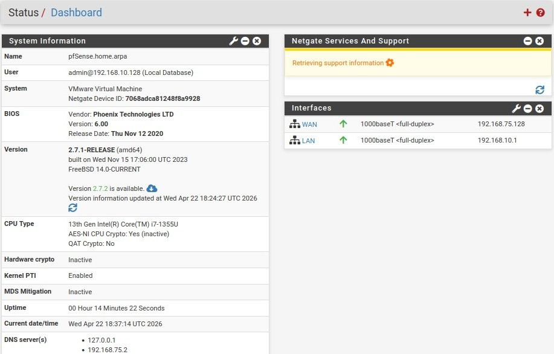

# Phase 01 – Environment Setup

## Objective

The objective of this phase is to build a controlled lab environment where network traffic can be monitored and controlled through a firewall.

---

## Lab Architecture

The lab environment consists of three virtual machines:

- Firewall: pfSense
- Victim: Ubuntu Server (LAN)
- Attacker: Kali Linux (external network)

The firewall acts as a gateway between an internal network (LAN) and an external attacker-controlled network.

Logical topology:

Attacker (Kali) → pfSense → Internal Network (Ubuntu)

---

## Network Configuration

The lab uses three virtual networks in VMware:

- WAN (VMnet8 - NAT)
  - Provides internet access to the firewall

- LAN (VMnet1 - Host-Only)
  - Internal network for the Ubuntu server

- Attacker Network (VMnet2 - Host-Only)
  - Isolated network where the attacker (Kali Linux) resides

---

## pfSense Setup

The pfSense firewall is configured with three interfaces:

- WAN Interface
  - Connected to VMnet8 (NAT)
  - Provides internet access

- LAN Interface
  - IP Address: 192.168.10.1/24
  - DHCP Server: Enabled
  - Used by internal systems (Ubuntu)

- OPT1 Interface (Attacker Network)
  - Connected to VMnet2
  - Used to simulate an external attacker network

---

## Ubuntu Setup

The Ubuntu Server machine was configured with:

- Network Adapter: Host-Only (VMnet1)
- IP Address: Assigned automatically via DHCP from pfSense

The Ubuntu server is placed in the internal LAN and uses pfSense as its default gateway.

---

## Attacker Setup

Kali Linux is configured as an external attacker machine:

- Network Adapter: VMnet2 (Host-Only)
- IP Address: 192.168.20.129
- Default Gateway: pfSense (WAN/OPT1 interface)

This setup simulates an attacker attempting to access the internal network.

---

## Connectivity Verification

The connectivity between the firewall and the Ubuntu server was verified using:

- ICMP (ping) tests
- Access to the pfSense web interface from Ubuntu

Successful communication confirms that the lab environment is correctly configured.

---

## Evidence

---

## Conclusion

The environment has been successfully set up.

The firewall is operational, and internal network communication is working as expected.  
This provides a solid foundation for configuring firewall rules and simulating security incidents in the next phases.
