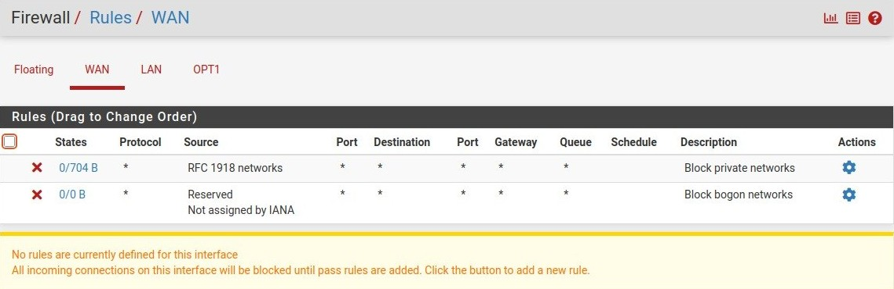
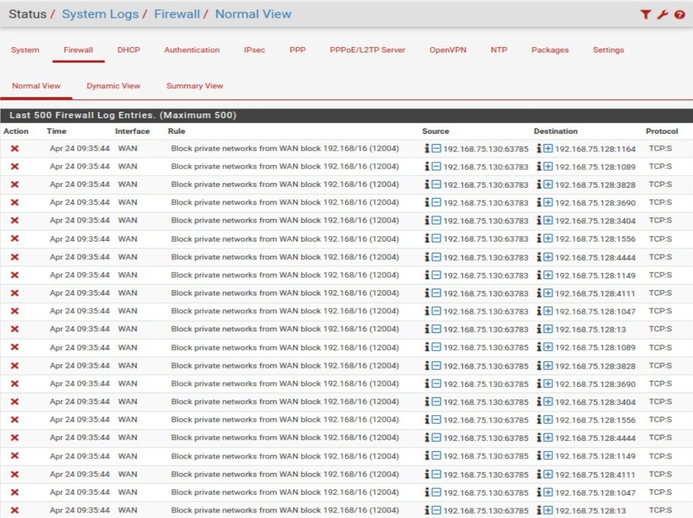

# Phase 02 – Firewall Configuration and Baseline Setup

## Objective

The objective of this phase is to analyze and validate the default behavior of the firewall, ensuring that it enforces a secure baseline configuration before introducing any custom rules.

---

## Network Context

The lab environment consists of three isolated network segments:

- WAN (External / Attacker Network)
- LAN (Internal Network - Ubuntu)
- OPT1 (Isolated Attacker Network - Kali Linux)

All traffic between these segments is routed through the pfSense firewall.

---

## Baseline Firewall Behavior

By default, the firewall enforces a **deny-all policy on the WAN interface**, meaning:

- No incoming connections from external networks are allowed
- No services are exposed to the WAN
- All unsolicited traffic is blocked

Additionally:

- Private (RFC1918) and bogon networks are explicitly blocked on the WAN interface
- The LAN interface allows outbound traffic by default, enabling internal hosts to access external networks

---

## Connectivity Testing

To validate the firewall behavior, multiple tests were performed from the attacker machine (Kali Linux):

### 1. WAN Reachability Test

- ICMP (ping) requests to the WAN interface failed
- This confirms that the firewall does not respond to unsolicited external requests

### 2. Port Scanning

- A network scan using `nmap` showed all ports in a **filtered state**
- This indicates that the firewall is actively blocking incoming connections

### 3. Internal Network Access Test

- Attempts to reach the internal Ubuntu server from the attacker network failed
- `traceroute` results showed no response beyond the firewall
- TCP connection attempts resulted in timeouts

This confirms that:

- Traffic from WAN to LAN is effectively blocked
- Internal systems are not exposed externally

---

## Logging and Visibility

Firewall logs were analyzed to verify traffic handling:

- Blocked traffic from the attacker network is recorded
- Source and destination IP addresses are visible
- The logs confirm that the firewall is actively filtering unauthorized traffic

---

## Evidence

### WAN Rules (Default Deny Configuration)

### Firewall Logs (Blocked Traffic)

---

## Conclusion

The firewall is operating with a secure baseline configuration:

- A default-deny policy is enforced on the WAN interface
- No services are exposed externally
- Unauthorized traffic is blocked and logged
- Internal network resources are protected from external access

This baseline provides a secure foundation for the next phase, where controlled firewall rules will be introduced to allow and manage specific traffic.
