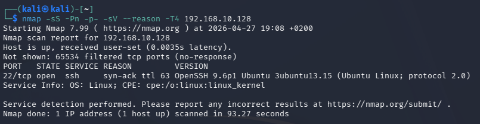

# Phase 04 – Attack Simulation

## Objective

The objective of this phase is to simulate realistic attacker behavior at the network level in order to generate observable traffic patterns within the firewall.

No defensive actions are performed during this phase. The focus is on reconnaissance and service probing activities that will later be analyzed.

---

## Context

The internal Ubuntu server exposes a limited attack surface, with only the SSH service (port 22) accessible through the firewall.

From an attacker’s perspective, this represents a typical scenario where initial reconnaissance is required to identify available services and potential entry points.

---

## Attack Methodology

The attack simulation was conducted from the attacker machine using a combination of full port scanning and service probing techniques.

---

### Full Port Scan and Service Probing

A comprehensive TCP SYN scan combined with service detection was executed:

nmap -sS -Pn -p- -sV --reason -T4 192.168.10.128

This command performs:

- A stealth TCP SYN scan across all ports
- Service version detection on discovered services
- Aggressive timing to simulate realistic attacker behavior
- Reason output to explain port states

---

## Observations

- The scan identified port 22 (SSH) as open
- All other ports were reported as filtered, indicating active firewall filtering
- A large number of connection attempts were generated toward multiple ports
- The attacker focused on identifying exposed services and gathering additional information

This activity reflects a typical reconnaissance phase, where an attacker maps the target surface before attempting further exploitation.

---

## Evidence

### Network Scan Output

---

## Conclusion

The attack simulation successfully generated realistic reconnaissance and probing traffic.

The performed scan mimics common attacker behavior during the initial stages of an intrusion attempt, including port discovery and service identification.

No defensive actions were taken during this phase, ensuring that the generated traffic can be analyzed in the next phase from a defensive perspective.

This provides a solid foundation for detecting suspicious patterns and implementing appropriate countermeasures.
