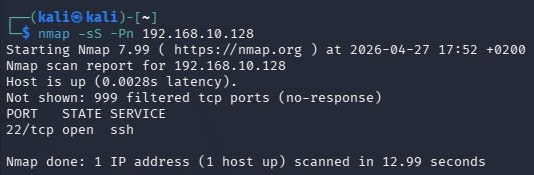
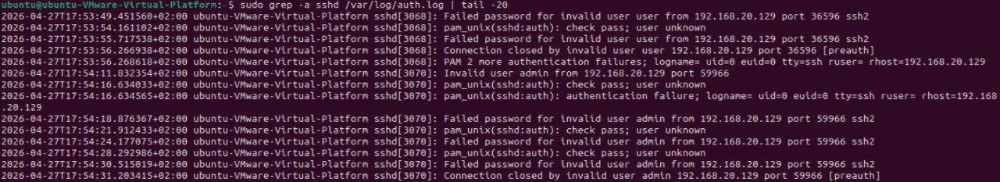
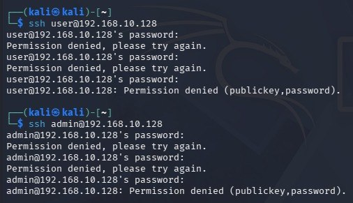

# Phase 04 – Attack Simulation

## Objective

The objective of this phase is to simulate realistic attacker behavior in order to generate observable activity within the lab environment.

No defensive actions are taken during this phase. The goal is to produce meaningful data that will later be analyzed in the detection and incident response phase.

---

## Context

The internal Ubuntu server exposes an SSH service (port 22), which was intentionally allowed in the previous phase.

From the attacker perspective, this represents a potential entry point into the internal network.

---

## Attack Simulation

The attack simulation was performed from the attacker machine using two main techniques:

### 1. Network Scanning

A full TCP scan was executed to identify exposed services on the target system:

nmap -sS -Pn 192.168.10.128

This scan simulates reconnaissance and service enumeration activities typically performed by an attacker.

The results confirmed that:

- Port 22 (SSH) is open
- All other ports are filtered by the firewall

---

### 2. Unauthorized Access Attempts

Multiple SSH login attempts were performed using invalid credentials:

ssh user@192.168.10.128
ssh admin@192.168.10.128

Each attempt involved entering incorrect passwords multiple times, simulating repeated unauthorized access attempts from the attacker machine.

This activity mimics common attacker behavior, where multiple usernames are tested to identify valid credentials or weak configurations.

---

## Evidence Collection (Host Level)

To verify the impact of the simulated attack, system logs were analyzed on the Ubuntu server:

sudo grep -a sshd /var/log/auth.log | tail -20

The logs show multiple failed authentication attempts, including:

- Invalid user attempts
- Failed password entries

These entries confirm that the attack activity reached the target system and was processed by the SSH service.

---

## Key Observations

- The firewall allowed access only to the explicitly permitted service (SSH)
- All other ports remained inaccessible during scanning
- Repeated authentication failures were successfully logged on the target system
- The attacker behavior generated a recognizable pattern of activity

---

## Evidence

### Network Scan

### SSH Access Attempts

### SSH Logs (Ubuntu)

---

## Conclusion

The attack simulation successfully generated realistic attacker activity within the lab environment.

The combination of network scanning and repeated unauthorized access attempts produced clear and verifiable traces both at the network and host level.

No defensive actions were taken during this phase, ensuring that the generated data can be properly analyzed in the next phase.

This sets the foundation for detection, analysis, and incident response activities.
